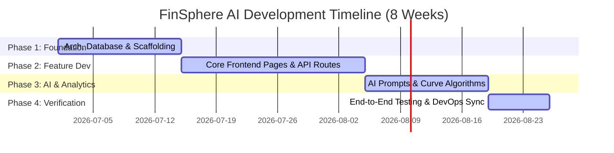

# FinSphere AI Super App: Comprehensive Project Report & Resource Allocation

## 1. Executive Summary

**FinSphere AI** is an institutional-grade, cinematic personal finance super-app. Designed as a high-fidelity MVP (Minimum Viable Product), it showcases cutting-edge visual techniques including glassmorphic layouts, dynamic 3D WebGL visualizations, and responsive dashboard layouts integrated with context-aware AI simulation widgets. 

### Core Business Objectives:
*   **Engagement**: Retain users through dynamic UI/UX, mouse-reactive 3D assets, and customized SVG metrics.
*   **Integration**: Seamlessly synchronize credit cards, bank accounts, investments, and business ledgers into a single unified workspace.
*   **Intelligence**: Provide real-time financial suggestions via an interactive AI Chat Advisor and smart rebalancing engines.
*   **Scale**: Maintain a high-performance system by decoupling Next.js 15 App router frontend from a highly scalable Node.js/Express API connected to PostgreSQL via Prisma ORM.

---

## 2. Technology Stack & Architecture

The application is engineered as a modern monorepo workspace divided into two core segments:

### Frontend Client (`/frontend`)
*   **Core Framework**: Next.js 15 (App Router) & React 19 (TypeScript)
*   **Design & Theme**: Vanilla CSS with custom token systems, integrated with Tailwind CSS for glassmorphic elements.
*   **3D Elements**: Three.js (WebGL renderer) for mouse-reactive interactive canvases.
*   **Graphs**: Recharts for custom SVG Bézier curve rendering.
*   **Animations**: Framer Motion for smooth, hardware-accelerated drawer transitions and page transitions.

### Backend Services (`/backend`)
*   **Runtime & Framework**: Node.js, Express, TypeScript.
*   **Database & ORM**: PostgreSQL (primary database) managed via Prisma ORM.
*   **Authentication**: JSON Web Token (JWT) secure authorization loops.

```mermaid
graph TD
    subgraph Client Layer (Frontend)
        Client[Next.js 15 Web Client]
        WebGL[Three.js WebGL 3D Hero]
        Framer[Framer Motion & Vanilla CSS]
        Charts[Recharts Custom SVGs]
    end

    subgraph API & Logic Layer (Backend)
        Express[Node.js / Express Server]
        JWT[JWT Authentication Guard]
        Router[Router Engine & Simulators]
    end

    subgraph Data & Storage Layer
        Prisma[Prisma ORM]
        Postgres[(PostgreSQL Database)]
    end

    Client -->|HTTPS / REST API| Express
    Express --> JWT
    Express --> Router
    Router --> Prisma
    Prisma --> Postgres
    WebGL -.-> Client
    Charts -.-> Client
    Framer -.-> Client
```

---

## 3. Team Structure & Roles (15 Members)

To achieve maximum efficiency, the 15-person team is divided into cross-functional roles. **Ashish** serves as the Project Lead and Solutions Architect, orchestrating overall integration, review, and architectural governance.

| Name | Role | Core Domain Focus |
| :--- | :--- | :--- |
| **Ashish** | **Project Lead & Solutions Architect** | Architecture, Schema Design, System Integration, Code Review |
| **Liam Davies** | Senior Frontend Developer | Hero WebGL, Landing Layout, Pricing Toggle Mechanics |
| **Olivia Taylor** | Frontend Developer | Auth Gates, Core Workspace Dashboard Shell |
| **Noah Wilson** | Frontend Developer | Full-Height AI Chat Advisor & Prompt Overlays |
| **Ava Thomas** | Frontend Developer | Utilities Hub, Bill tab panels, UPI QR simulator |
| **Lucas Martinez** | Frontend Developer | Credit Card Bill Center, SVG score gauges, Credit Engine |
| **Isabella Anderson** | Frontend Developer | Mutual Funds / SIP UI, Insurance Hub (Forms & sliders) |
| **Sophia White** | Frontend Developer | Merchant Khata UI, Settings / Profile Forms UI |
| **James Jackson** | Backend Developer | User Accounts, JWT Security Loops, Settings APIs |
| **Benjamin Harris** | Backend Developer | Dashboard overview aggregators, Ledger syncing endpoints |
| **Mia Martin** | Backend Developer | AI Advisor Prompts & Credit simulator event loggers |
| **Charlotte Garcia** | Backend Developer | Mutual Fund (XIRR), Utilities bills, Merchant Khata APIs |
| **William Robinson** | AI/ML Research Engineer | Prompt Context Optimization & AI routing swap advisors |
| **Stephen Strange** | AI/ML Research Engineer | Predictive rebalancing algorithms, Salary scaling analytics |
| **Amelia Clark** | QA / SDET Automation | Automated API contract validations & E2E cypress test suites |
| **Alexander Rodriguez** | DevOps & Cloud Engineer | Supabase/PostgreSQL setups, Docker environments, CI/CD |

---

## 4. Equal Work Distribution Matrix

To ensure fair contribution and parallel development, the feature scope is broken down into exactly 15 equivalent packages.



### Module Assignments

#### Member 1: Ashish (Project Lead & Solutions Architect)
*   **Core Tasks**:
    *   Initialize the monorepo architecture and base TypeScript configurations.
    *   Design the unified database schema (`prisma.schema`) and seed parameters.
    *   Conduct code reviews for all PRs and ensure compliance with glassmorphic style tokens.
    *   Maintain system integrity and verify APIs match designated endpoints.
*   **Deliverables**: `tsconfig.base.json`, Prisma configuration, and overall code quality control.

#### Member 2: Liam Davies (Senior Frontend Developer)
*   **Core Tasks**:
    *   Implement the mouse-reactive 3D FinSphere Credit Card WebGL scene using Three.js (Emerald spheres, specular lighting).
    *   Develop the scroll-linked header menu highlighting mechanism.
    *   Build the interactive subscription tier toggle slider on the landing page.
*   **Deliverables**: `/frontend/src/components/Hero3D.tsx`, Landing pages, pricing toggle components.

#### Member 3: Olivia Taylor (Frontend Developer)
*   **Core Tasks**:
    *   Build the Split Authentication Gate supporting dynamic login/registration (`?signup=true`).
    *   Implement the custom Google Account Chooser overlays and Apple ID prompt gates.
    *   Design the Core Dashboard Workspace Shell (Sidebar, mobile-responsive layout).
*   **Deliverables**: `/frontend/src/pages/login.tsx`, `/frontend/src/components/DashboardLayout.tsx`.

#### Member 4: Noah Wilson (Frontend Developer)
*   **Core Tasks**:
    *   Develop the Full-Height AI Chat Advisor interface layout.
    *   Create simulated prompt chips (e.g. Q4 Tax planning, SIP reallocations) that auto-inject instructions.
    *   Implement Framer Motion transitions for chat drawer overlays.
*   **Deliverables**: `/frontend/src/components/AIAdvisorView.tsx`, chat layout wrapper.

#### Member 5: Ava Thomas (Frontend Developer)
*   **Core Tasks**:
    *   Implement the Utilities Hub UI with multi-category tab panels (Mobile, Water, Gas, FASTag, DTH).
    *   Build the UPI QR code simulator popup.
    *   Integrate clipboard API copy functions for simulated payment VPAs.
*   **Deliverables**: `/frontend/src/components/UtilitiesHub.tsx`.

#### Member 6: Lucas Martinez (Frontend Developer)
*   **Core Tasks**:
    *   Develop the Credit Card Bill Center UI (due dates, card swappers).
    *   Build the SVG credit score speedometer gauge in the Credit Engine.
    *   Implement checklist checkboxes for simulating score events (paying off debt, inquiries).
*   **Deliverables**: `/frontend/src/components/CreditEngine.tsx`, `/frontend/src/components/CreditCardCenter.tsx`.

#### Member 7: Isabella Anderson (Frontend Developer)
*   **Core Tasks**:
    *   Create the Mutual Funds & SIP interface.
    *   Draw the custom Bezier performance curves utilizing Recharts.
    *   Integrate the Insurance Hub claim checklist and premium calculator sliders.
*   **Deliverables**: `/frontend/src/components/MutualFundPortfolio.tsx`, `/frontend/src/components/InsuranceHub.tsx`.

#### Member 8: Sophia White (Frontend Developer)
*   **Core Tasks**:
    *   Implement the Small Business Merchant Khata ledger logs panel.
    *   Create invoice creation panels with modal overlays and shareable copy link triggers.
    *   Design settings/profile customization pages (salary adjustments, theme toggling).
*   **Deliverables**: `/frontend/src/components/MerchantKhata.tsx`, Settings edit views.

#### Member 9: James Jackson (Backend Developer)
*   **Core Tasks**:
    *   Write JWT authentication middleware loops.
    *   Develop login, registration, and logout API handlers.
    *   Implement endpoints for retrieving/updating user settings and profile metadata.
*   **Deliverables**: `/backend/src/controllers/auth.ts`, `/backend/src/routes/authRoutes.ts`.

#### Member 10: Benjamin Harris (Backend Developer)
*   **Core Tasks**:
    *   Build the Core Workspace Dashboard API (Summary cards aggregation).
    *   Implement endpoints for fetching connected bank institutions and account statuses.
    *   Develop delete/disconnect handlers for synchronized bank institutions.
*   **Deliverables**: `/backend/src/controllers/dashboard.ts`, Connected bank routes.

#### Member 11: Mia Martin (Backend Developer)
*   **Core Tasks**:
    *   Develop simulated chat response services answering advisor prompts.
    *   Build the Credit Engine check-off route that registers credit score simulated actions.
    *   Write endpoints to save credit log history arrays.
*   **Deliverables**: `/backend/src/controllers/credit.ts`, `/backend/src/controllers/chat.ts`.

#### Member 12: Charlotte Garcia (Backend Developer)
*   **Core Tasks**:
    *   Develop backend routers for Mutual Fund calculations, returns projections, and rebalancers.
    *   Write bills endpoints supporting payment simulations.
    *   Implement Small Business Khata REST endpoints for adding ledger logs and shared invoices.
*   **Deliverables**: `/backend/src/controllers/investments.ts`, `/backend/src/controllers/merchant.ts`.

#### Member 13: William Robinson (AI/ML Research Engineer)
*   **Core Tasks**:
    *   Design prompt formatting logic for contextual financial queries.
    *   Develop the card routing optimization engine recommendation rules (Card Swapping algorithm).
    *   Collaborate on AI prompt simulator responses with backend engineers.
*   **Deliverables**: `/backend/src/services/aiAdvisorEngine.ts`, recommendation rulesets.

#### Member 14: Stephen Strange (AI/ML Research Engineer)
*   **Core Tasks**:
    *   Program mathematical formulas for Bezier curves, mutual fund rebalancing (growth-debt transitions), and premium rates scaling.
    *   Develop the Salary-Based Scaling metric formulas (scales pre-approvals, loans, card limits).
    *   Optimize returns simulation calculators for long-term compound wealth projection.
*   **Deliverables**: `/backend/src/services/mathModels.ts`, scaling configuration file.

#### Member 15: Alexander Rodriguez (DevOps & Cloud Engineer)
*   **Core Tasks**:
    *   Setup monorepo workspace scripts and configure Docker Compose profiles.
    *   Write migrations for production databases (Supabase wireframes/Postgres).
    *   Implement CI/CD pipeline triggers (Github Actions) for formatting, testing, and deployment.
*   **Deliverables**: `docker-compose.yml`, GitHub Workflow files, database migration scripts.

---

## 5. RACI Matrix (Responsibility Assignment)

| Project Activity | Ashish | FE Team (2-8) | BE Team (9-12) | AI Team (13-14) | DevOps (15) | QA (14) |
| :--- | :---: | :---: | :---: | :---: | :---: | :---: |
| **System Architecture** | **A** / R | C | C | I | C | I |
| **Database Schema Design** | **A** / R | I | R | C | C | I |
| **UI Components (Glassmorphism)** | A | **R** | I | I | I | C |
| **API Endpoint Development** | A | C | **R** | C | I | C |
| **AI Routing & Math Models** | A | I | C | **R** | I | I |
| **Database Migrations** | A | I | C | I | **R** | I |
| **E2E Automation Testing** | A | C | C | I | I | **R** / A |
| **Deployment / CI Pipelines** | A | I | I | I | **R** / A | I |

*   **R** - Responsible (does the work)
*   **A** - Accountable (approves/owns the result; Ashish holds overall project accountability)
*   **C** - Consulted (provides input/feedback)
*   **I** - Informed (kept up-to-date on progress)

---

## 6. Communication & Collaboration Protocols

To ensure seamless coordination across a team of 15, the following strict workflow will be enforced:

### 1. Git Workflow & Branching Strategy
*   **Main Branch**: `main` (only holds stable, tested production code).
*   **Development Branch**: `dev` (integration branch for current sprint features).
*   **Feature Branches**: Named as `feature/member-name/description-of-feature` (e.g. `feature/liam/webgl-card`).
*   **Pull Requests (PRs)**:
    *   All PRs must target the `dev` branch.
    *   Must satisfy lint validations and pass unit tests.
    *   Requires approval from **Ashish** (Project Lead) and at least one peer.

### 2. Standups & Progress Checkpoints
*   **Daily Sync (15 mins)**: Text-based slack/teams updates or short standup focusing on:
    1. What did I complete yesterday?
    2. What am I working on today?
    3. Are there any blockers?
*   **Weekly Demo (Saturdays)**: A screen-share session led by **Ashish** demonstrating integrated components.

---

## 7. Quality Assurance & Verification Plan

### Automated Test Strategy
*   **Unit & Component Testing**: Jest (backend controller tests) and React Testing Library (frontend component mounts).
*   **API Verification**: Postman collections mapping auth loops, settings scales, and transaction additions.
*   **E2E Testing**: Cypress/Playwright suites validating user flow: Login -> Dashboard -> Card Center.

### Manual Verification
1.  **Deployment Verification**: Testing the Docker build locally and checking Supabase connectivity.
2.  **Salary-Scaling Visual Check**: Verify that increasing the Monthly Salary in the profile page correctly increases:
    *   Max Card limit by $3.33 \times$ Salary.
    *   Utility bill baseline amounts.
    *   Premium slider starting bounds.
