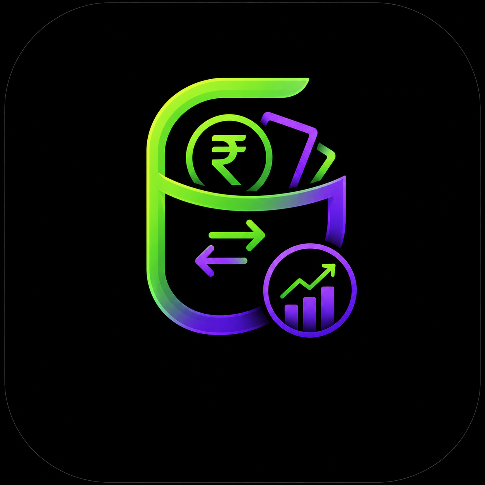
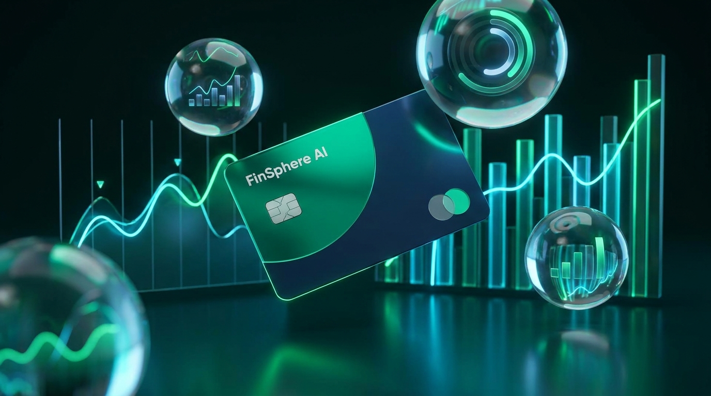
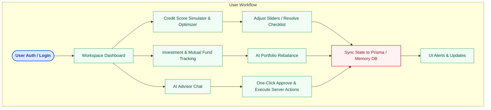

<div align="center">
  
  <br/>
  
  
  # ✨ FinSphere AI Super App ✨
  
  **Premium • Cinematic • Interactive Financial Simulation**
  
  A premium, cinematic personal finance super-app MVP built with high-fidelity glassmorphism, responsive elements, and interactive AI simulators. 
  
  [](https://nextjs.org/)
  [](https://www.typescriptlang.org/)
  [](https://expressjs.com/)
  [](https://www.postgresql.org/)
  [](https://www.prisma.io/)
  [](https://tailwindcss.com/)

  ---
</div>

## 🎨 Visual Identity & Design Aesthetics

FinSphere AI is crafted with a meticulous visual system that delivers a cinematic and premium fintech experience.

*   **Colors & Palette (Glassmorphism & Cinematic Tones)**:
    *   **Light Mode**: Features a clean interface with translucent glassmorphic elements and high-contrast dark accents.
    *   **Dark Mode**: Deep cinematic backgrounds accented with neural pulse visualizers and glowing particle orbs.
*   **Typography**:
    *   **Display Text**: Modern sans-serif headers tailored to reinforce a high-end, premium fintech identity.
    *   **Body Text**: Clean, readable fonts optimized for complex dashboards and financial data interpretation.
*   **Micro-Animations & Delighters**:
    *   **Dynamic SVG Forecasting**: Smooth Bezier curve transformations mapped out for long-term forecasts.
    *   **Cinematic Particles**: Floating particle and orb animations on the Landing Page.
    *   **Transitions**: Smooth page routing, drag-handle sidebar scaling, and simulated loading states (e.g. TouchID/FaceID simulators).

---

## ⚙️ Tech Stack

The application uses a modern, highly-integrated TypeScript stack spanning client and server layers:

| Layer | Technology | Key Purpose / Feature |
| :--- | :--- | :--- |
| **Frontend** | Next.js 15 & React | Type-safe, high-performance SSR and client-side rendering. |
| **Data Viz** | Recharts | Custom monthly, category, and investment charts. |
| **Animations** | Framer Motion | Fluid animations, interactive components, and state transitions. |
| **Styling** | Tailwind CSS | Utility-first glassmorphic UI design and responsive viewport layouts. |
| **Server Engine** | Express.js & Node.js | Handles secure API endpoints and JWT authentication (e.g., `/api/advisor/chat`). |
| **Database & ORM** | PostgreSQL + Prisma | Robust SQL database query interface and data modeling. |
| **AI Integration** | Google Gemini API | Powers the interactive AI Advisor with offline local fallback rule calculations. |
| **Auth & Security** | JWT / WebAuthn Sim | Simulated TouchID/FaceID, custom Google/Apple account choosers, and 2FA generator. |

---

## 🔄 Core Workflows & Logic



---

## 🚀 Key Feature Updates & Enhancements

1. **Credit Score Engine & Simulator**:
   - Built a custom, interactive scoring gauge utilizing SVG circular paths.
   - Added dynamic sliders to simulate paying off debt, mortgage hard inquiries, and credit limit increases.
2. **Dedicated Login & Registration Flow**:
   - Built a custom **Google Account Chooser** modal and **Sign-in with Apple ID** prompt.
3. **Sidebar Resizing & Drag Handle Merger**:
   - Merged sidebar resizing logic with a custom-styled mint-green scrollbar handle (200px to 450px scaling).
4. **Dynamic SVG Forecasting Timeline**:
   - Enabled select options for 5-Year and 10-Year forecasts with smooth SVG Bezier curve path transformations.
5. **Interactive AI Advisor Chat Backend & Execution**:
   - Integrated Google Gemini API with offline local fallback rule calculations.
   - Built frontend one-click **"Approve & Execute"** adjustment cards that run updates on the server.
6. **Advanced Unique Settings Security**:
   - Built a high-fidelity TouchID/FaceID scanner simulator with progress loaders and unique WebAuthn Key IDs.

---

## 📂 Project Directory Structure

```text
├── backend/               # Express server implementation
│   ├── src/               # Source files including server routing
│   ├── store-prisma.ts    # Prisma database bindings
│   ├── store-inmemory.ts  # Fallback in-memory database
│   ├── package.json       # Backend manifest
│   └── vercel.json        # Production routing config
├── frontend/              # Next.js Frontend SPA
│   ├── public/            # Static assets (images, icons)
│   │   ├── aplogfi.png    # Primary Logo
│   │   └── hero-finsphere.png # Hero Image
│   ├── src/               # Frontend source components and pages
│   │   ├── components/    # Reusable React components (UI, Visualizations)
│   │   ├── app/           # Next.js App Router Pages
│   │   └── hooks/         # Custom React hooks
│   ├── tailwind.config.ts # Styling layout metrics & extensions
│   └── package.json       # Frontend manifest
├── docs/                  # Markdown documentation & guides
└── package.json           # Root workspace config & scripts
```

---

## 📂 Page-by-Page Feature Tour

### 1. Landing Page (Home)
- **Features**: Dynamic Underlines, Hero Call-to-Actions, AI Engine Neural Pulse, Legal Footers.
### 2. Authentication Center (/login)
- **Features**: Suspense-bound signup, Google & Apple Sign-In Simulator, Visual Backdrop.
### 3. Workspace Dashboard (Overview)
- **Features**: Financial Metrics, Connected Feeds.
### 4. AI Advisor Chat
- **Features**: Full Canvas Layout, Contextual Prompts.
### 5. Utilities Hub
- **Features**: Payment Categories, UPI QR Code Simulator.
### 6. Credit Card Bill Center
- **Features**: Outstanding Balance Cards, Optimal Card Routing.
### 7. Credit Engine & Simulator
- **Features**: Interactive checklist, Simulated inquiries.
### 8. Investments & Sparklines
- **Features**: Smooth Sparkline Wave, Stock Holding Records.
### 9. Mutual Fund Portfolio
- **Features**: AI Rebalance Advisor, Thematic Funds.
### 10. SIP Setup
- **Features**: Expected future values calculations.
### 11. Insurance Hub
- **Features**: Filing Claims, Premium Calculator.
### 12. Merchant Khata
- **Features**: Transaction rendering, invoice creation, payment link simulators.
### 13. Rewards & Offers
- **Features**: Coin Converters, Milestone Trackers.
### 14. Reports & Charts
- **Features**: Custom Recharts charts.
### 15. Settings View
- **Features**: Profile Editing, System Prefs, Developer Access.

---

## ✅ Feasibility Analysis

### Technical Feasibility
FinSphere AI is built using modern, production-ready technologies (Next.js 15, Express, Prisma, PostgreSQL). The modular architecture allows easy integration with external APIs.
### Operational & Economic Feasibility
The platform features an intuitive UI and is highly scalable with cloud-based platforms like Vercel and PostgreSQL Cloud, minimizing infrastructure costs.
### Legal Feasibility
The MVP uses simulated data. Commercial deployment requires RBI Guidelines Compliance, PCI-DSS Compliance, and Data Encryption.

---

## ⚠️ Limitations
* Banking transactions and APIs are currently simulated.
* AI recommendations use rule-based fallbacks or demonstration datasets.
* Credit scores and investment predictions use mock datasets for educational purposes.

---

## 🌟 Unique Selling Points (USP)
1. **All-in-One Financial Super App**: Consolidates tracking, investing, insurance, credit, and bill payments.
2. **AI-Powered Assistant**: Integrated Lumi provides interactive, personalized guidance.
3. **Interactive Financial Simulators**: Engaging ways to simulate financial impacts.
4. **Premium User Experience**: Glassmorphism, animations, and high-quality UX.
5. **Modular Architecture**: Ready for enterprise scaling.

---

## 🚀 Future Scope
- **AI & ML**: Personalized recommendations via LLMs, predictive forecasting.
- **Banking**: Open Banking API aggregation, real-time sync.
- **Investments**: Live stock market/mutual fund integration.
- **Credit**: Live CIBIL score checks.
- **Security**: True Biometric Auth and MFA integration.

---

## 🛠️ Installation & Local Development

### Prerequisites
*   Node.js (v18 or higher)
*   npm or yarn

### Run Locally:
```bash
# Install dependencies for both frontend and backend
npm install

# Run the full-stack development server
npm run dev
```

- **Frontend**: `http://localhost:7000` (Use this as the local test server link for checking the frontend web client)
- **API**: `http://localhost:4000`
- **Accounts**: Create a custom account instantly using the sign-up forms or mock OAuth integrations.
