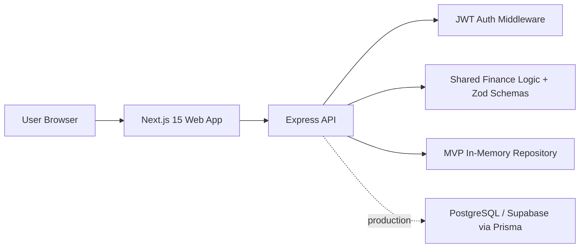

# FinSphere AI Architecture

## Folder Structure

- `apps/web`: App Router frontend, Tailwind design system, charts, MVP workflows.
- `apps/api`: Express backend with JWT auth and protected finance endpoints.
- `packages/shared`: shared types, Zod schemas, credit/health/budget calculations.
- `packages/db`: Prisma PostgreSQL schema and seed script.
- `src/design-system`: source token reference.
- `docs`: architecture, API contracts, deployment guide, status reports.

## Data Flow

1. User logs in or registers from the Next.js client.
2. API validates payloads with shared Zod schemas.
3. API returns a JWT and safe user profile.
4. Protected requests send `Authorization: Bearer <token>`.
5. Finance modules mutate/read the MVP repository.
6. Dashboard, reports, credit, and health endpoints aggregate data with shared calculation helpers.

## Production Database Path

The current API repository is intentionally seeded in memory so judges can run the demo instantly. The Prisma schema models the production PostgreSQL target and can be connected to Supabase by providing `DATABASE_URL`, running migrations, and replacing the repository calls with Prisma queries without changing public API contracts.
